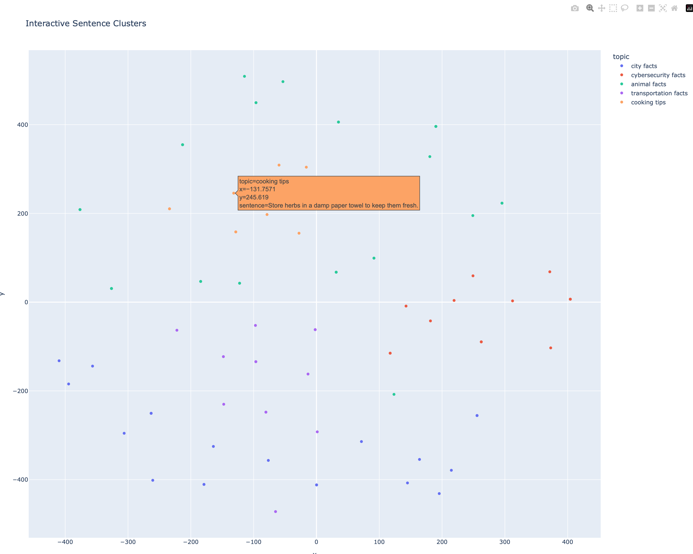

# Hello VectorDB
A simple Python application for working with Qdrant vector database. This project demonstrates how to load CSV data with sentences and topics, convert them to vectors using sentence transformers, and perform semantic search.

## Installation
### 1. Install uv
```bash
curl -LsSf https://astral.sh/uv/install.sh | sh
```

### 2. Install dependencies
```bash
uv sync
```

## Setup
### 1. Start Qdrant with Docker
```bash
docker run -p 6333:6333 qdrant/qdrant
```

### 2. Prepare your CSV data
Create a CSV file with two columns:
- Column 1: Sentences
- Column 2: Topics (tags basically)

Alternatively, feel free to use vdb_facts.csv in the repo

## Usage
### Load data into vector database
```bash
uv run python main.py --csv vdb_facts.csv
```

### Search for similar sentences
```bash
uv run python main.py --query "your search sentence here"
```

### Load data and search in one command
```bash
uv run python main.py --csv data.csv --query "machine learning"
```

### Visualize sentence clusters (visualize.py)
```bash
# Basic t-SNE visualization
uv run python visualize.py

# Interactive plot with hover information
uv run python visualize.py --interactive
```




## Command Line Arguments (main.py)

- `--csv`: Path to input CSV file (optional)
- `--query`: Search query sentence (optional)
- `--collection_name`: Name of the Qdrant collection (default: "collection_0")
- `--host`: Qdrant host (default: "localhost")
- `--port`: Qdrant port (default: 6333)

## Technical Details
- **Vector model**: `all-MiniLM-L6-v2` (384 dimensions)
- **Distance metric**: Cosine similarity
- **Vector database**: Qdrant
- **Embedding library**: Sentence Transformers

## Example Output
```bash
git:(master) ✗ uv run main.py --query "sea, lots of legs"
Collection 'collection_0' already exists with correct dimensions
Using existing collection 'collection_0'
...
Search results:
1. Score: 0.2653
   Sentence: Octopuses have three hearts and blue blood.
   Topic: animal facts
```